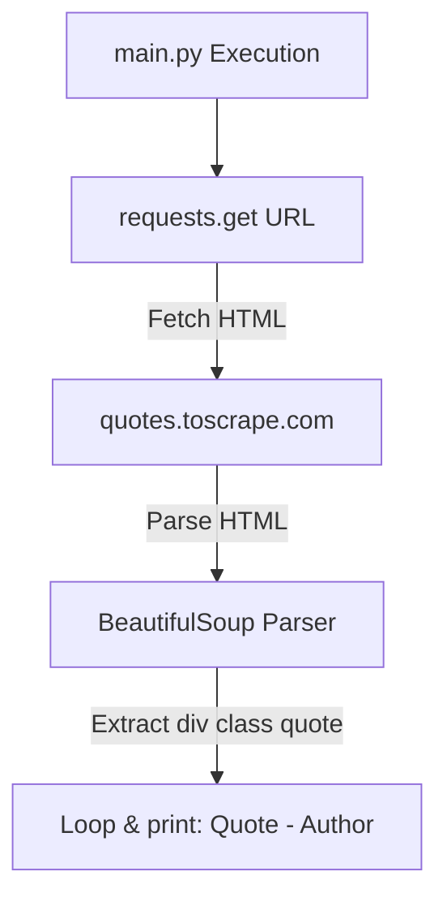

# Learn Web Scraping

[](https://www.python.org/)
[](https://www.crummy.com/software/BeautifulSoup/)

## Table of Contents

- [Context](#-context)
- [Software features](#-software-features)
- [Technologies and tools](#-technologies-and-tools)
- [Architecture](#-architecture)
- [Repository structure](#-repository-structure)
- [Requirements](#-requirements)
- [How to run](#-how-to-run)
- [Author](#-author)

# 📌 Context 

This project is a repository dedicated to learning and practicing web scraping in Python. The script extracts quotes and their respective authors from the sandbox site `https://quotes.toscrape.com/` using HTTP requests and HTML parsing.

## 🚀 Software features

- **Web Data Extraction:** Fetches static HTML content from websites using the `requests` library.
- **HTML Parsing:** Parses and queries page structures using `BeautifulSoup` to locate class elements.
- **Data Filtering:** Iterates through parsed quote blocks to cleanly extract and print only the text content and the author's name.

## 🛠️ Technologies and tools

- Python 3
- Requests (HTTP Library)
- BeautifulSoup4 (HTML Parser)

## 📋 Architecture



## 📂 Repository structure

```text
- 📂 lab-web-scraping/
  - 📄 main.py (Main Python script containing scraping logic)
  - 📄 requirements.txt (Python dependencies file)
```

## 📦 Requirements

- Python 3.10+
- Active internet connection (to connect to `quotes.toscrape.com`)

## ⚙️ How to run

### 1. Clone the Repository
Clone the repository to your local machine:
```bash
git clone https://github.com/MatheusRodri/lab-web-scraping.git
cd lab-web-scraping
```

### 2. Set Up a Virtual Environment (Optional but Recommended)
Create and activate a virtual environment:

**On Windows (PowerShell):**
```powershell
python -m venv venv
.\venv\Scripts\Activate.ps1
```

**On Windows (Command Prompt):**
```cmd
python -m venv venv
.\venv\Scripts\activate.bat
```

**On Linux/macOS:**
```bash
python3 -m venv venv
source venv/bin/activate
```

### 3. Install Dependencies
Install the required packages from `requirements.txt`:
```bash
pip install -r requirements.txt
```

### 4. Run the Script
Execute the scraping script:
```bash
python main.py
```

## 👤 Author

Matheus Rodrigues 
[LinkedIn](https://linkedin.com/in/matheus-rodrigues-mrj) [GitHub](https://github.com/MatheusRodri)